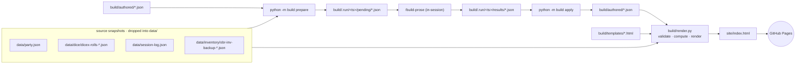

# dnd-data

A static GitHub Pages site visualizing data from an ongoing D&D campaign.

## How it works

JSON snapshots from external sources (character sheets, dice roller, Owlbear Rodeo, session log) are dropped into `data/` (gitignored). A deterministic Python builder reads those snapshots plus a small store of human-authored prose, validates everything, and renders `site/index.html` via Jinja2 templates. A GitHub Actions workflow uploads the committed `site/` directory to GitHub Pages.

When new source data lands, the authored prose store needs new entries (kill verses, session summaries, NPC epithets, etc.) and existing entries may need a refresh. That work runs locally in a single command: the `/build-prose` skill inside a Claude Code session, which drives prepare → in-session authoring → apply end-to-end. See [Build architecture](#build-architecture).

See [`CLAUDE.md`](CLAUDE.md) for full architecture detail and validation rules.

## Build pipeline



The source files under `data/` are gitignored — they carry real player names that must never reach `site/index.html`. `build/render.py`'s loaders scrub names at read time using the substring map in `build/dice-players.json`. Versioned git hooks under `.githooks/` reject any commit, message, or pushed change whose content matches a known full-name pattern.

## Build architecture

The `build` package prepares authoring slices, dispatches them to in-session sub-agents via the `/build-prose` skill, and then applies the returned prose to `build/authored/*.json` before re-rendering. Each transformer is a single slice file paired with a frozen system prompt and JSON Schema; the sub-agent's only job is to turn one slice into one schema-conformant prose object. The orchestrator itself is deterministic Python.

```mermaid
sequenceDiagram
    autonumber
    participant U as upstream + authored
    participant P as python -m build prepare
    participant RD as build/.run/&lt;ts&gt;/
    participant BP as /build-prose (in-session)
    participant SA as sub-agents (×N slices)
    participant AP as python -m build apply
    participant A as authored/*.json
    participant R as render.py

    P->>U: load data + authored state
    P->>RD: write manifest.json + pending/*.json + frozen prompts
    BP->>RD: read manifest, pending slices, prompts
    BP->>SA: dispatch one sub-agent per slice
    SA-->>RD: results/*.json (schema-validated by apply)
    AP->>RD: validate each result vs frozen schema
    AP->>A: apply prose, bump marker on full refresh success
    AP->>R: run render.py
```

- **Entry point** (`build/__main__.py`) — `prepare` / `apply` subcommand dispatcher. A bare `python -m build` is the same as `prepare` and prints the `/build-prose` command to run next.
- **Prepare** (`build/prepare.py`) — walks the transformer registry, parses frontmatter from `.claude/prompts/<name>.md`, builds slices, and writes `manifest.json` + `pending/*.json` + frozen prompt/schema copies under `build/.run/<timestamp>/`.
- **Slice builders** (`build/slices.py`) — pure functions of `(data, authored)` returning `(key, slice_data)` tuples per category; key matching determines what's missing and needs authoring.
- **Transformer registry** (`build/registry.py`) — single source of truth listing every transformer (append + refresh), its slice builder, and its schema.
- **Apply** (`build/apply_cli.py`, `build/apply.py`) — validates each `results/*.json` against the frozen schema, applies the returned prose to the in-memory authored store, persists via `build/store.py`, bumps `site.refreshed_through_session` on full refresh-pass success, and then invokes `build/render.py`.
- **`/build-prose` skill** (`.claude/skills/build-prose/`) — drives the slice queue inside a Claude Code session, dispatching one sub-agent per pending slice. Each sub-agent receives only the slice + frozen prompt + schema; no Claude Code tools.

Validation gates the render: any `MISSING` or `MALFORMED` authored entry causes `render.py` to exit 1. Fix the authored entry and re-run apply.

The run directory under `build/.run/<timestamp>/` is preserved on failure for inspection (and on success with `prepare --keep-temp`); otherwise it is cleaned up automatically after a clean apply.

Each transformer's preferred model (`sonnet` or `opus`) is declared in YAML frontmatter at the top of `.claude/prompts/<name>.md`. Sonnet handles per-item, short-output transformers (`append-kills`, `append-sessions`, `append-npcs`, `refresh-npcs`, `refresh-intro-epithet`); Opus handles slices that aggregate across the campaign and grow with it (`append-chapters`, `append-characters`, `refresh-chapters`, `refresh-characters`, `refresh-road-ahead`).

## Files

- `site/` — the served artifact directory (uploaded to GitHub Pages by the deploy workflow).
  - `site/index.html` — committed build artifact.
  - `site/styles.css` — the design system.
  - `site/images/` — character portrait tokens, referenced by each entry's `image` field in `data/party.json`.
- `data/` — ingestion directory for source files (contents gitignored).
  - `data/party.json`, `data/session-log.json`, `data/dice/dicex-rolls-*.json`, `data/inventory/obr-inv-backup-*.json` — source data files, dropped in manually from external exports.
- `build/` — the build orchestrator (Python package). Entry point: `python -m build`.
  - `build/__main__.py` — orchestrator entry point; `prepare` / `apply` subcommand dispatcher.
  - `build/render.py` — deterministic Python renderer (validates authored entries, computes derived data, renders via Jinja2).
  - `build/paths.py`, `store.py`, `slices.py`, `registry.py`, `prepare.py`, `apply.py`, `apply_cli.py`, `inventory.py` — orchestrator submodules.
  - `build/.run/<timestamp>/` — per-run scratch dir (gitignored): `manifest.json`, `pending/`, frozen `prompts/`, and `results/` written by `/build-prose`.
  - `build/templates/` — Jinja2 partials for page structure.
  - `build/authored/` — JSON prose store (`kills`, `sessions`, `chapters`, `npcs`, `characters`, `site`); the only writable surface for the orchestrator.
  - `build/dice-players.json` — substring map (first-name or handle → site slug); never records full real names.
- `.claude/prompts/` — paired prompt and schema files, one pair per transformer; each prompt declares its preferred model in YAML frontmatter.
- `.claude/skills/build-prose/` — the `/build-prose` skill that drives the slice queue in-session.
- `tests/` — pytest suite covering validators, key matching, computation formulas, slice builders, and bestiary lookup.
- `requirements.txt` — Python dependencies.
- `.github/workflows/deploy-pages.yml` — uploads `site/` to GitHub Pages on push to `main`.
- `.claude/skills/bestiarylookup/` — looks up creatures in 5etools data; consulted by `render.py` for the "Kinds Slain" trial card.
- `.claude/ext/5etools-src` — symlink to a local 5etools-src checkout, gitignored. See `.claude/ext/README.md`.
- `.githooks/` — versioned `pre-commit` / `commit-msg` / `pre-push` hooks that block forbidden-name leaks.
- `docs/superpowers/specs/`, `docs/superpowers/plans/` — design specs and implementation plans.

## Local setup

```bash
python3 -m venv .venv
.venv/bin/pip install -r requirements.txt
git config core.hooksPath .githooks
ln -s /path/to/5etools-src .claude/ext/5etools-src
```

## Local build + rebuild

Inside a Claude Code session, the whole build is one command:

```
/build-prose
```

The skill runs `python -m build prepare`, dispatches one sub-agent per pending slice to author prose, then runs `python -m build apply` to validate, persist, and render. If a slice fails, fix the prompt or slice and re-run `/build-prose <run-dir>` (the run dir path is printed by the skill) to resume — already-authored slices are skipped.

The two underlying CLIs can still be invoked directly when needed:

```bash
.venv/bin/python -m build prepare               # gather pending slices into build/.run/<timestamp>/
.venv/bin/python -m build apply build/.run/<timestamp>/   # validate, apply, render
```

A bare `.venv/bin/python -m build` is equivalent to `prepare`.

To re-render without re-authoring (when `build/authored/*.json` is already current):

```bash
.venv/bin/python build/render.py
```

Useful flags:

- `prepare --no-refresh` — skip the discovery and refresh passes (append-only).
- `prepare --force-refresh` — run them even when the marker is current.
- `prepare --keep-temp` — preserve the run dir on success.
- `apply --skip-render` — apply results but don't rebuild the site.

The render aborts with `MISSING` / `MALFORMED` / `ORPHAN` errors before writing output if any authored entry is missing required fields. Fix the authored entry and re-run `apply`.

To publish: pull `main`, run `/build-prose`, commit `site/index.html` and `build/authored/*.json`, push.

## Tests

```bash
.venv/bin/pytest tests/
```

## Local preview

```bash
python3 -m http.server 8765 --bind 127.0.0.1 --directory site
```

Then open <http://127.0.0.1:8765/>.

## GitHub Pages

Configure once: **Settings → Pages → Source: GitHub Actions**.

The `.github/workflows/deploy-pages.yml` workflow runs on every push to `main`, uploads the `site/` directory as a Pages artifact, and deploys it. The deploy workflow does not invoke `build/render.py` — `site/index.html` is committed and served as-is.
