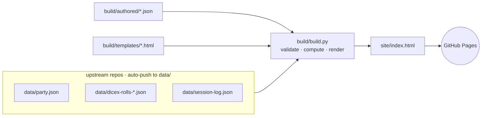

# dnd-data

A static GitHub Pages site visualizing data from an ongoing D&D campaign.

## How it works

Three upstream repos auto-push JSON snapshots into `data/` (gitignored). A deterministic Python builder reads those snapshots plus a small store of human-authored prose, validates everything, and renders `site/index.html` via Jinja2 templates. A GitHub Actions workflow uploads the committed `site/` directory to GitHub Pages.

When new upstream data lands, the authored prose store needs new entries (kill verses, session summaries, NPC epithets, etc.) and existing entries may need a refresh. That work runs locally as `python -m hydrate` — see [Hydration architecture](#hydration-architecture).

See [`CLAUDE.md`](CLAUDE.md) for full architecture detail and validation rules.

## Build pipeline



The three upstream files under `data/` are gitignored — they carry real player names that must never reach `site/index.html`. `build/build.py`'s loaders scrub names at read time using the substring map in `build/dice-players.json`. Versioned git hooks under `.githooks/` reject any commit, message, or pushed change whose content matches a known full-name pattern.

## Hydration architecture

`hydrate/` is a Python package that authors prose into `build/authored/*.json` and runs `build/build.py`. Each transformer is a single non-interactive `claude -p` call: a system prompt from `.claude/prompts/<name>.md`, a slice JSON delivered on stdin, and a JSON Schema-validated response. The orchestrator is deterministic Python; the model's only job is to turn one slice into one schema-conformant prose object.

```mermaid
sequenceDiagram
    autonumber
    participant U as upstream + authored
    participant H as hydrate (Python)
    participant T as temp dir
    participant C as claude -p (×N transformers)
    participant A as authored/*.json
    participant B as build.py

    H->>U: load data + authored state
    H->>T: persist slice + prompt body (debug artifact)
    H->>C: stdin=slice<br/>--system-prompt-file<br/>--json-schema
    C-->>H: structured_output (schema-validated)
    H->>A: apply prose; bump marker on full refresh success
    H->>B: run build.py
```

- **Orchestrator** (`hydrate/__main__.py`) — drives the append pass, then the refresh pass, then the build. Pure Python; makes all decisions about *what* to send to the model.
- **Slice builders** (`hydrate/slices.py`) — pure functions of `(data, authored)` returning `(key, slice_data)` tuples per category. Mirrors the slicing logic that lived in the retired `helpers.py`.
- **Transformer invocation** (`hydrate/invoke.py`) — for each slice, parses frontmatter from `.claude/prompts/<name>.md`, writes the body to a temp file, runs `claude -p` with the body file + slice on stdin + schema. Returns the validated `structured_output` dict.
- **Apply** (`hydrate/apply.py`) — writes returned prose into the in-memory authored store; `hydrate/store.py` persists.
- **Build loop** (`hydrate/build_loop.py`) — runs `build/build.py` and reports.

The model has no tools (`--disallowedTools` lists every Claude Code tool; `--permission-mode plan` doubles up). The full slice and the stripped prompt body are persisted to a per-run temp dir for inspection on failure; the user removes the temp dir manually after a clean run.

Each transformer's preferred model (`sonnet` or `opus`) is declared in YAML frontmatter at the top of `.claude/prompts/<name>.md`. Sonnet handles per-item, short-output transformers (`append-kills`, `append-sessions`, `append-npcs`, `refresh-npcs`, `refresh-intro-epithet`); Opus handles slices that aggregate across the campaign and grow with it (`append-chapters`, `append-characters`, `refresh-chapters`, `refresh-characters`, `refresh-road-ahead`).

## Files

- `site/` — the served artifact directory (uploaded to GitHub Pages by the deploy workflow).
  - `site/index.html` — committed build artifact.
  - `site/styles.css` — the design system.
  - `site/images/` — character portrait tokens, referenced by each entry's `image` field in `data/party.json`.
- `data/` — ingestion directory for upstream files (contents gitignored).
  - `data/party.json`, `data/dicex-rolls-*.json`, `data/session-log.json` — upstream data files, auto-pushed.
- `build/` — the build script and its inputs.
  - `build/build.py` — deterministic Python renderer (validates authored entries, computes derived data, renders via Jinja2).
  - `build/templates/` — Jinja2 partials for page structure.
  - `build/authored/` — JSON prose store (`kills`, `sessions`, `chapters`, `npcs`, `characters`, `site`); the only writable surface for the hydrator.
  - `build/dice-players.json` — substring map (first-name or handle → site slug); never records full real names.
- `hydrate/` — prose-authoring orchestrator (Python package). Entry point: `python -m hydrate`.
- `.claude/prompts/` — paired prompt and schema files, one pair per transformer; each prompt declares its preferred model in YAML frontmatter.
- `tests/` — pytest suite covering validators, key matching, computation formulas, slice builders, and bestiary lookup.
- `requirements.txt` — Python dependencies.
- `.github/workflows/deploy-pages.yml` — uploads `site/` to GitHub Pages on push to `main`.
- `.claude/skills/bestiarylookup/` — looks up creatures in 5etools data; consulted by `build.py` for the "Kinds Slain" trial card.
- `.claude/ext/5etools-src` — symlink to a local 5etools-src checkout, gitignored. See `.claude/ext/README.md`.
- `.githooks/` — versioned `pre-commit` / `commit-msg` / `pre-push` hooks that block forbidden-name leaks.
- `docs/superpowers/specs/`, `docs/superpowers/plans/` — design specs and implementation plans.

## Local setup

```bash
python3 -m venv .venv
.venv/bin/pip install -r requirements.txt
git config core.hooksPath .githooks
ln -s /path/to/5etools-src .claude/ext/5etools-src
```

## Local hydrate + rebuild

```bash
# Author any missing prose, then render site/index.html:
.venv/bin/python -m hydrate

# Render only (assumes the authored store is already current):
.venv/bin/python build/build.py
```

The build aborts with `MISSING` / `MALFORMED` / `ORPHAN` errors before writing output if any authored entry is missing required fields. Fix the authored entry and re-run.

## Tests

```bash
.venv/bin/pytest tests/
```

## Local preview

```bash
python3 -m http.server 8765 --bind 127.0.0.1 --directory site
```

Then open <http://127.0.0.1:8765/>.

## GitHub Pages

Configure once: **Settings → Pages → Source: GitHub Actions**.

The `.github/workflows/deploy-pages.yml` workflow runs on every push to `main`, uploads the `site/` directory as a Pages artifact, and deploys it. The deploy workflow does not invoke `build/build.py` — `site/index.html` is committed and served as-is.
