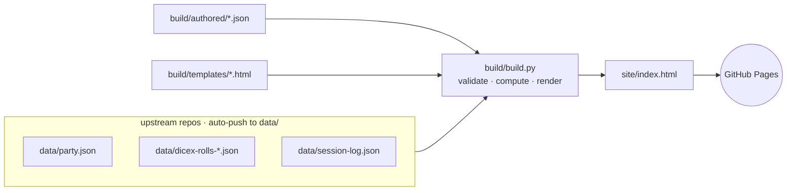
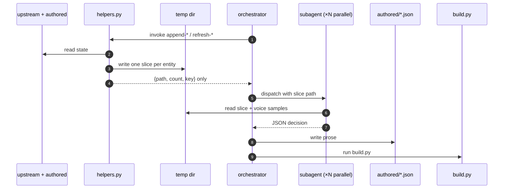

# dnd-data

A static GitHub Pages site visualizing data from an ongoing D&D campaign.

## How it works

Three upstream repos auto-push JSON snapshots into `data/` (gitignored). A deterministic Python builder reads those snapshots plus a small store of human-authored prose, validates everything, and renders `site/index.html` via Jinja2 templates. A GitHub Actions workflow uploads the committed `site/` directory to GitHub Pages.

When new upstream data lands, the authored prose store needs new entries (kill verses, session summaries, NPC epithets, etc.) and existing entries may need a refresh. That work happens in a local Claude Code session via the `hydrate-ledger` skill — see [Hydration architecture](#hydration-architecture).

See [`CLAUDE.md`](CLAUDE.md) for full architecture detail and validation rules.

## Build pipeline



The three upstream files under `data/` are gitignored — they carry real player names that must never reach `site/index.html`. `build/build.py`'s loaders scrub names at read time using the substring map in `.claude/skills/hydrate-ledger/dice-players.json`. Versioned git hooks under `.githooks/` reject any commit, message, or pushed change whose content matches a known full-name pattern.

## Hydration architecture

`hydrate-ledger` is the local Claude Code skill that authors prose into `build/authored/*.json` and runs `build/build.py`. It splits into three layers so the orchestrator's context stays roughly constant as the campaign grows.



- **Orchestrator** — the skill itself. Reads `build/authored/*.json` and small upstream metadata for diffing; never reads narrative.
- **Slice helpers** (`helpers.py`) — deterministic CLI subcommands that introspect upstream + authored state, write one slice file per entity to a per-run temp dir, and print only `{path, count, key}` to stdout.
- **Dispatched subagents** — spawned via the Agent tool, in parallel. Each receives one slice path plus a category-specific prompt template under `.claude/skills/hydrate-ledger/dispatch/*.md`, reads the slice and `voice-samples.md`, and returns one JSON decision object.

The core invariant: **the orchestrator never reads slice contents.** If it ever ingested slice bytes its context would grow with the campaign and the architecture would be pointless. The temp directory is cleaned only on full success; any failure preserves it so the user can inspect exactly what each agent saw.

Full design: [`docs/superpowers/specs/2026-04-25-subagent-dispatch-architecture-design.md`](docs/superpowers/specs/2026-04-25-subagent-dispatch-architecture-design.md).

## Files

- `site/` — the served artifact directory (uploaded to GitHub Pages by the deploy workflow).
  - `site/index.html` — committed build artifact.
  - `site/styles.css` — the design system.
  - `site/images/` — character portrait tokens, referenced by each entry's `image` field in `data/party.json`.
- `data/` — ingestion directory for upstream files (contents gitignored).
  - `data/party.json`, `data/dicex-rolls-*.json`, `data/session-log.json` — upstream data files, auto-pushed.
- `build/` — the build script and its inputs.
  - `build/build.py` — deterministic Python renderer (validates authored entries, computes derived data, renders via Jinja2).
  - `build/templates/` — Jinja2 partials for page structure.
  - `build/authored/` — JSON prose store (`kills`, `sessions`, `chapters`, `npcs`, `characters`, `site`); the only writable surface for the hydrate-ledger skill.
- `tests/` — pytest suite (61 cases) covering validators, key matching, computation formulas, slice helpers, and bestiary lookup.
- `requirements.txt` — Python dependencies.
- `.github/workflows/deploy-pages.yml` — uploads `site/` to GitHub Pages on push to `main`.
- `.claude/skills/hydrate-ledger/` — orchestrator workflow, slice helpers, dispatch templates, voice samples, and the dice-player name map.
- `.claude/skills/bestiarylookup/` — looks up creatures in 5etools data; used by `hydrate-ledger`.
- `.claude/ext/5etools-src` — symlink to a local 5etools-src checkout, gitignored. See `.claude/ext/README.md`.
- `.githooks/` — versioned `pre-commit` / `commit-msg` / `pre-push` hooks that block forbidden-name leaks.
- `docs/superpowers/specs/`, `docs/superpowers/plans/` — design specs and implementation plans.

## Local setup

```bash
python3 -m venv .venv
.venv/bin/pip install -r requirements.txt
git config core.hooksPath .githooks
ln -s /path/to/5etools-src .claude/ext/5etools-src
```

## Local rebuild

```bash
.venv/bin/python build/build.py
```

The build aborts with `MISSING` / `MALFORMED` / `ORPHAN` errors before writing output if any authored entry is missing required fields. Fix the authored entry and re-run.

## Tests

```bash
.venv/bin/pytest tests/
```

## Local preview

```bash
python3 -m http.server 8765 --bind 127.0.0.1 --directory site
```

Then open <http://127.0.0.1:8765/>.

## GitHub Pages

Configure once: **Settings → Pages → Source: GitHub Actions**.

The `.github/workflows/deploy-pages.yml` workflow runs on every push to `main`, uploads the `site/` directory as a Pages artifact, and deploys it. The deploy workflow does not invoke `build/build.py` — `site/index.html` is committed and served as-is.
